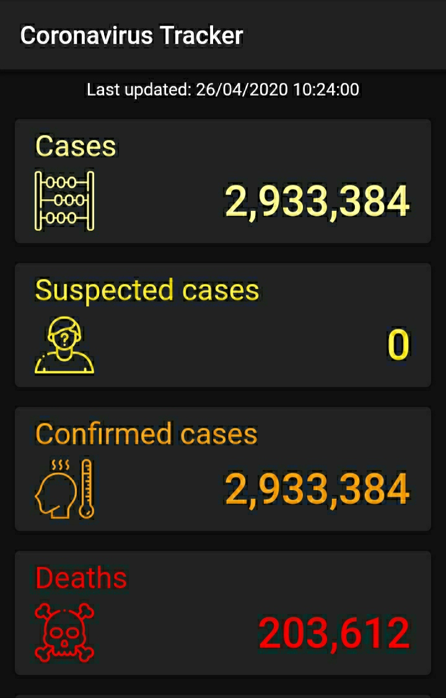

# Coronavirus REST API Flutter App

## Note about files in .gitignore

The following files contain API keys and are not included in the repository:

- `.vscode/settings.json`
- `lib/app/services/api_keys.dart`

When cloning this project, make sure to define your local copies.
